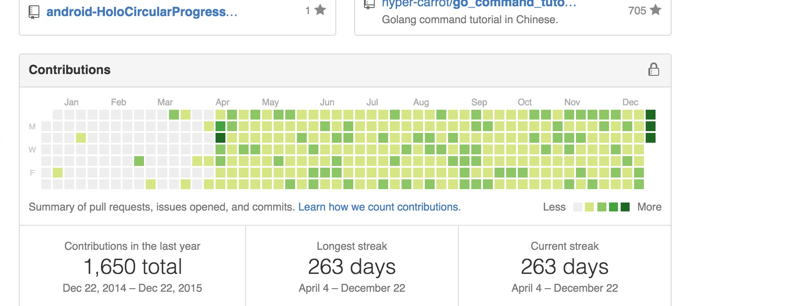

# Node Greenhat
:construction_worker: Quick hack for making real work happen.

Make your github `Contributions` look awesome. This is inspired by [Greenhat](https://github.com/4148/greenhat)
(https://github.com/4148/greenhat)


# Usage

```
git clone git@github.com:sweetvvck/node-greenhat.git

cp greenhat.js your_github_project

cd your_github_project

(sudo) npm i async

node greenhat.js days fromDate

#days means how many days you want to fill your contributions
#fromDate means from when(not include that day) you want to fill your contributions
```
